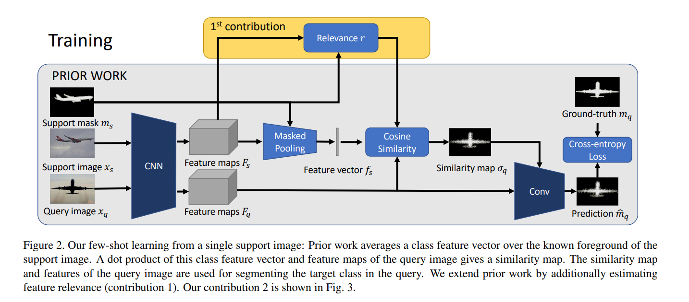
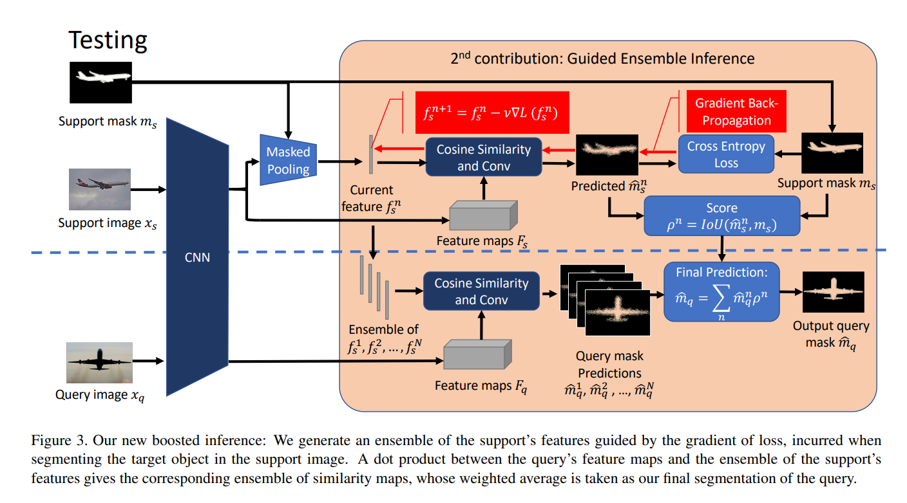

論文來源：[https://arxiv.org/abs/1909.13140](https://arxiv.org/abs/1909.13140)

## 簡介

這篇論文主要是有關於 few-shot segmentation of foreground object in images，其中描述原作者有提出創新的方法來改善原本 few-shot segmentation 的效果。達成的改善有：（1）改善模型預測出來的 features 能在 foreground（想分割目標）有很高的activations，在其他地方（背景）則是很低。（2）測試時，當分割 support images 時，計算它的 gradient of loss 來改善模型預測的結果。

 - - -

## 論文中用到的變數名稱

* \\\(x_s\\\) = support image
* \\\( x_q \\\) = query image
* \\\( m_s \\\) = binary segmentation masks of \\\( x_s \\\) 
* \\\( m_q \\\) = binary ground truth
* \\\(\hat{m}_q \\\) = predicted query mask
* \\\( F_s \\\) = feature maps of \\\( x_s \\\) output from backbone
* \\\( F_q \\\) = feature maps of \\\( x_q \\\) output from backbone
* \\\( \tilde m_s \\\) = \\\( m_s \\\) down_sampled 到和 \\\( F_s \\\) 有相同大小的結果 
* \\\( f_s \\\) = feature vectors of support image
* 下面是Masked Pooling的計算方式：
  
$$ f_s = \frac{1}{\vert \tilde m_s \vert} \sum^{wh}_{i=1} F_{s,i} \ \tilde m_{s,i} $$

$$ \vert \tilde m_s \vert = \sum_i \tilde m_{s,i} $$

 - - -

## 論文中使用到的改善方法

論文提供兩種改善方式：

1. Feature Weighting

   
論文中使用一種 regularization，提高 foreground 的 feature activations 並同時降低 background 的 feature activation。這讓 regularization 成為一個最大化 relevant differences between feautures activations 總和的 optimization 問題。接著論文提到他們使用以下的運算來達成目的。
   
$$\phi_s = \sum_{i=1}^{wh} F_{s,i}\left[\frac{\tilde{m}_{s,i}}{\vert \tilde{m}_s\vert} - \frac{1-\tilde{m}_{s,i}}{wh - \vert\tilde{m}_s\vert}\right]$$

$$\mathop{maximize}\limits_{r} \ \  \phi_s^T r, \ \ s.t. \ \ \Vert r\Vert _2 = 1$$

而 relevance \\\( r \\\) 可透過計算下列式子得出近似解。

$$r^* = \frac{\phi_s}{\Vert\phi_s\Vert_2}$$

最後 \\\( r^* \\\) 用來計算 support images 和 query images 之間的 similarity map。只是論文魔改原本計算 \\\( f_s \\\) 和 \\\( F_q \\\) 的 cosine similarity 成下面的式子，其中 \\\( \bigodot \\\) 是 element-wise product。

$$ \sigma^*_{q,i} = cos(f_s, F_{q,i}, r^*) = \frac{(f_s \bigodot r^*)^T (F_{q,i} \bigodot r^*)}{\Vert f_s \bigodot r^*\Vert_2 \cdot \Vert F_{q,i} \bigodot r^*\Vert_2} $$

接著 \\\( \sigma_q \\\) 和 Feature map \\\( F_q \\\) 合體，送進 Conv layer 計算 \\\( \hat m_q \\\)，最後和 query image 的 ground truth \\\( m_q \\\) 計算 Cross-entropy Loss 來更新模型的權重。

1. Feature Boosting

在測試階段，作者又加上第二種改進方式，計算 support image 的 similarity map \\\( \sigma^*_s \\\) 和 \\\( F_s \\\) 一起進入 Conv layer 計算 \\\( \hat m_s \\\)，然後和 support mask \\\( m_s \\\) 計算 Cross-entropy Loss，以迭代的方式更新 \\\( f_s \\\)，總共 \\\( N \\\) 次。

$$f_s^{n+1} = f_s^n - \nu \frac{\partial L(\hat m^n_s, m_s)}{\partial f_s^n}$$

另外，還會利用 \\\( \hat m_s \\\) 計算 \\\( p \\\)。

$$p^n = IoU(\hat m_s^n, m_s)$$

接著剛剛計算的 \\\( N \\\) 個 \\\( f_s \\\) 會和 \\\( F_q \\\) 計算 similarity map，得出 \\\( N \\\) 個 \\\( \sigma^*_q \\\)，和 \\\( F_q \\\) 一起送入 Conv layer 得到 \\\( N \\\) 個 \\\( \hat m_q \\\)。這些 \\\( \hat m_q \\\) 會和剛才計算出來的 \\\( p \\\) 一起計算出最後預測的結果 \\\( \hat m_q \\\)。

$$\hat m_q = \sum^N_{n=1} \hat m^n_q p^n$$

作者在論文中提到，contribution 1 會用在模型訓練和測試階段，而 contribution 2 則是只會在測試階段使用。

---

## K-shot的場合

當 support images 的數量大於 \\\( K \\\) 時，會計算出 \\\( \hat m_q^k \\\)，分別對應到 \\\( K \\\) 個 support images，並且會計算平均 \\\( \hat m_q \\\)，\\\( \hat m_q = \frac{1}{K}\sum^K_{k=1} \hat m_q^k \\\)。另外在 contribution 1 計算 relevance \\\( r \\\) 會用到的 \\\( \phi_s \\\) 則是

$$\phi_s = \sum^{K}_{k=1} \sum^{wh}_i F^k_{s,i} \left[\frac{\tilde m^k_{s,i}}{\vert \tilde m^k_s  \vert} - \frac{1 - \tilde m^k_{s,i}}{wh - \vert \tilde m^k_s \vert}\right]$$

Contribution 2 用到的 back-propagation 計算的方式改成如下

$$f^{n+1}_s = f^n_s - \nu \frac{\partial \sum^K_{k=1}  L(\hat m^k_s, m^k_s)}{\partial f_s^n}$$

只是原作者說它不會生成 \\\( K \\\) 個獨立的 \\\( \{ \\\)\\\( f^n_s : n = 1, ..., N \\\)\\\( \} \\\)，而是一開始計算 \\\( f^1_s \\\) 計算這 \\\( K \\\) 個 features 的平均

$$f^1_s = \frac{1}{K} \sum^K_{k=1} f^k_s$$

---
 
 ## 實作的細節

 論文中有提到，他們 backbone 使用 VGG-16 或 ResNet-101。只是最後兩層 convolutional layers 被改成 stride 等於 1（原本模型是 2），而且會結合 rate 分別為 2 或 4 的 dilated convolution 來擴大能容納的範圍。這樣的話，backbone 最後輸出比輸入小 \\\( 1/8 \\\) 的 feature maps。而最後要產生預測結果的 2-layer convolution network(Conv)，使用 128 channels的 \\\( 3 \times 3 \\\) convolution 在接上 \\\( ReLU \\\)，還有 2 channels 的 \\\( 1 \times 1 \\\) convolution 輸出預測結果 -- background 和 foreground。另外作者提到他們沒有使用 CRF 當作一個 common post-processing step。

 接下來還有其他實作細節，作者提到 backbone 原本先在 ImageNet訓練，訓練時圖片解析度為 \\\( 512 \times 512 \\\)，所以後來做 few-shot segmentation 也是使用相同的大小，所有測試圖則是保持它們原本的解析度。訓練時的 optimizer 使用 SGD，learning rate 為 \\\( 7e^{-3} \\\)，batch size 為 8，總共訓練 10,000 interations。除此之外，contribution 2 選擇的 \\\( N \\\) 為 10，為了更新 \\\( f^n_s \\\)，作者使用 Adam optimizer，\\\( \nu \\\) 等於 \\\( 1 e^{-2} \\\)。

 另外作者提到了整體的時間複雜度，\\\( O(Train) = O(CNN) + O(d \ w \ h) \\\)，\\\( O(Test) = O(CNN) + O(N \ d \ w \ h) \\\)，但是因為 \\\( O(d \ w \ h) \\\) 和 \\\( O(N \ d \ w \ h) \\\)通常都遠小於 \\\( O(CNN) \\\)，所以整體時間複雜度差不多為 \\\( O(CNN) \\\)。

 ---
 
 ## 我的疑問
 
 基本上是跟論文無關的問題

 1. Support image 和 Query image 是怎麼選擇而且是怎麼被送入模型的？
 $$\\$$
 2. 模型最後預測的結果是原圖的 \\\( 1/8 \\\)，那它是什麼方法來放大到原圖大小去和 ground truth 計算 loss？

